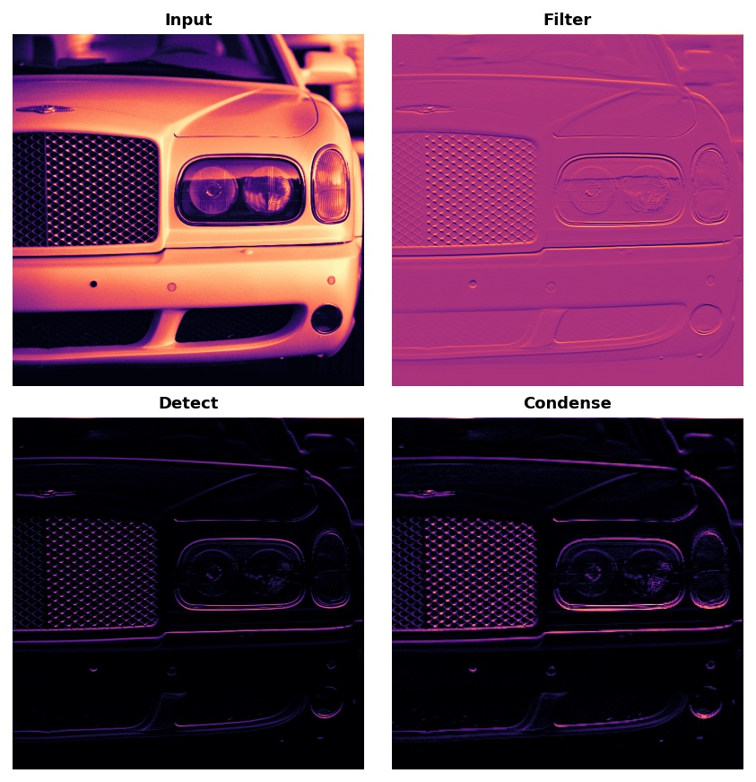

Source: [Kaggle Computer Vision Course](https://www.kaggle.com/learn/computer-vision/course)

## Introduction
Convolutional Neural Networks (CNNs/convnets) are well-suited for computer vision tasks. This tutorial focuses on the main parts of a CNN and how they work together to classify images.

## CNN Structure
A CNN used for image classification has the following parts:
- Base ⚾: it is responsible for extracting features from an image. Features could include lines, patterns, colours, textures, or any complicated combinations of these. This part mostly consits of convolution operations.
- Head 🧢: it is responsible for determining the class of an image. It includes mainly dense layers, but could include other layers such as dropout.
</li>

## Training Procedure
The model needs to learn two main things:
1. What features to extract
2. Which classes should go with each feature
Transfer learning is a technique commonly used which allows reusing the base of a pre-trained model with an untrained head, meaning that the model already knows what features to extract, so it just needs to learn how to classify these features.

## Keras Implementation
```python
from tensorflow import keras
from tensorflow.keras import layers

# load the pretrained base
pretrained_base = keras.models.load_model('../input/cv-course-models/cv-course-models/vgg16-pretrained-base',)
pretrained_base.trainable = False

# attach head
model = keras.Sequential([
    pretrained_base,
    layers.Flatten(),
    layers.Dense(6, activation='relu'),
    layers.Dense(1,activation='sigmoid'),
])
```

Now, it's time to train the model ⚙️:
```python
# define the training parameters such as loss, accuracy metric, and optimizer
model.compile(optimiser='adam',
    loss='binary_crossentropy',
    metrics=['binary_accuracy'],
)

history = model.fit(
    train_dataset, # this needs to be loaded beforehand (not implemented)
    validation_data=ds_valid,
    epochs=30,
    verbose=0,
)

# finally plot the loss and accuracy metrics
import pandas as pd
history_frame = pd.DataFrame(history.history)
history_frame.loc[:, ['loss', 'val_loss']].plot()
history_frame.loc[:, ['binary_accuracy', 'val_binary_accuracy']].plot()
```

## Feature Extraction
Feature extraction process in CNNs consists of three main steps:
- Convolution: filter an image on for a particular feature
- Activation (ReLU): detect the feature within the filtered image
- Pooling Layer (eg MaxPooling): condense the image to enhance the feature
  


The weights that a CNN learns during training are mostly contained within is convolution layres. These are called kernels, which operate by scaning over an image and generating a weighted sum of pixel values resulting in emphasising or de-emphasising of features.  

Activations/feature maps are the result of appying kernels to our input image. Generally, what a convolution accentuates in its inputs will match the shape of the positive numbers in the kernel.

A convolution layer can be defined in a Keras model as shown below:
```python
from tensorflow import keras
from tensorflow.keras import layers

model = keras.Sequential([
    layers.Conv2D(filters=64, kernel_size=3)
])
```
With `filters`, you can define the number of feature maps you'd like to create as output of the convolution layer. `kernel_size` defines the dimensions of the kernel, which is mostly odd-numbered.

### ReLU
A neuron with a rectifier function attached to it is called a rectifier linear unit. ReLU can be included as part of the definition of convolution layer:
```python
model = keras.Sequential([
    layers.Conv2D(filters=64, kernel_size=3, activation='relu')
])
```

ReLU assigns a value of zero to all negative values (ie all unimportant values are equally unimportant), while not changing the positive values.

### Max Pooling
Max Pool has a similar structure to a kernel except that it uses a simple sliding maximum operation. As such, it has a `pool_size` analogous to `kernel_size`, however, it does not have any trainable parameters.  
After ReLU, he feature maps ends up with a lot of dead space as a reult of assigning a value of zero to all negative values. Storing and carrying these zeros across the network only takes space without contributing much to the ouptut of the network. Instead, we condense the feature maps to retain only its useful parts.

## Stride and Padding
Both convolution and pooling operations are performed over a sliding window. With convolution, the window is given by the `kernel_size`, while this is given by the `pool_size` parameter for the pooling operation.  
- Stride: how far the window should move at each step, which is specified equally in both directions (one for moving left to right and one for moving top to bottom). Note that convolutional layers will most often have `strides=(1, 1)`. Increasing the stride means that we miss out on potentially valuble information in our summary. Maximum pooling layers, however, will almost always have stride values greater than 1, like (2, 2) or (3, 3), but not larger than the window itself.
- Padding: how to handle the pixels on the edge of the photo. Staying entirely inside the image means the window will never sit squarely over these boundary pixels like it does for every other pixel in the input. When we set padding='valid', the convolution window will stay entirely inside the input. The drawback is that the output shrinks (loses pixels), and shrinks more for larger kernels. This will limit the number of layers the network can contain, especially when inputs are small in size. The alternative is to use padding='same'. The trick here is to pad the input with 0's around its borders, using just enough 0's to make the size of the output the same as the size of the input. This can have the effect however of diluting the influence of pixels at the borders. Most modern convnets will use some combination of the two padding strategies.

### Keras Implementation
```python
from tensorflow import keras
from tensorflow.keras import layers

model = keras.Sequential([
    layers.Conv2D(filters=64,
        kernel_size=3,
        strides=1,
        padding='same',
        activation='relu',
    ),
    layers.MaxPool2D(pool_size=2,
        strides=1,
        padding='same',
    )
])
```
Sometimes a model uses larger strides, partnered with larger kernels, in its initial layer.The ResNet50 model, for instance, uses 7x7 kernels with strides of 2 in its first layer. This seems to accelerate the production of large-scale features without the sacrifice of too much information from the input.
## Convolutional Blocks
These convolutional blocks are stacks of Conv2D and MaxPool2D layers which allow feature extraction. By composing these blocks, CNNs can combine and recombine features produced, allowing a sophisticated feature engineering.
### CNN Keras Implementation
```python
from tensorflow import keras
from tensorflow.keras import layers

model = keras.Sequential([
    # first convolutional block
    layers.Conv2D(filters=32, 
        kernel_size=5, 
        activation='relu', 
        padding='same', 
        input_shape=[128, 128, 3]
    ),
    layers.MaxPool2D(),

    # second block
    layers.Conv2D(filters=64,
        kernel_size=3,
        activation='relu',
        padding='same',
    ),
    layers.MaxPool2D(),

    # third block
    layers.Conv2D(filters=128,
        kernel_size=3,
        activation='relu',
        padding='same',
    ),
    layers.maxPool2D(),

    # classifier head
    layers.Flatten(),
    layers.Dense(units=6, activation='relu'),
    layers.Dense(units=1, activation='sigmoid'),

])
model.summary()
```
Notice in this definition is how the number of filters doubled block-by-block: 32, 64, 128. This is a common pattern. Since the MaxPool2D layer is reducing the size of the feature maps, we can afford to increase the quantity we create.

## Data Augmentation
Data augmentation is a way of feeding more data into the model. It also helps teach the model to ignore the transformations that do not affect the classification outcome.Data augmentation is usually done online, meaning, as the images are being fed into the network for training.  
Each time an image is used during training, a new random transformation is applied. This way, the model is always seeing something a little different than what it's seen before. This extra variance in the training data is what helps the model on new data.  
It's important to remember though that not every transformation will be useful on a given problem. Most importantly, whatever transformations you use should not mix up the classes. If you were training a digit recognizer, for instance, rotating images would mix up '9's and '6's.
### Keras Implementation
```python
from tensorflow import keras
from tensorflow.keras import layers
# these are new features in TF 2.2
from tensorflow.keras.layers.experimental import preprocessing

pretrained_base = tf.keras.models.load_model(
    '../input/cv-course-models/cv-course-models/vgg16-pretrained-base',
)
pretrained_base.trainable = False

model = keras.Sequential([
    # Preprocessing
    preprocessing.RandomFlip('horizontal'), # flip left-to-right
    preprocessing.RandomContrast(0.5), # contrast change by up to 50%
    # Base
    pretrained_base,
    # Head
    layers.Flatten(),
    layers.Dense(6, activation='relu'),
    layers.Dense(1, activation='sigmoid'),
])
```